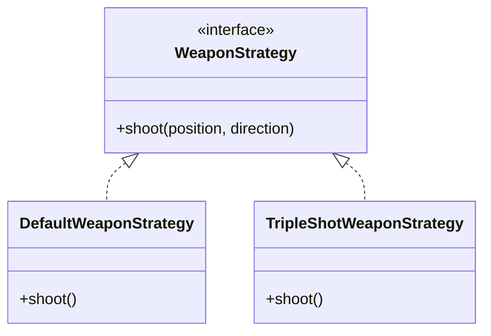

# 🎮 Neon Survivor - Enterprise Grade Survival Engine

Desenvolvido inteiramente no VS Code, este projeto representa uma implementação robusta e escalável de um motor de jogo 2D, utilizando práticas modernas de Engenharia de Software e a stack mais performática do ecossistema React.

## 🔭 Visão Geral

O **Neon Survivor** não é apenas um jogo; é uma demonstração técnica de um Game Loop determinístico desacoplado da camada de renderização. O coração do sistema é o `Survival Engine`, um motor físico leve capaz de gerenciar centenas de entidades simultâneas, detecção de colisão espacial e lógica de progressão (RPG), tudo rodando a 60 FPS estáveis.

A arquitetura foi desenhada para separar estritamente a **Lógica de Domínio (Core)** da **Camada de Apresentação (UI)**, garantindo manutenibilidade e testabilidade.

## 🛠️ Stack Técnica

A escolha tecnológica priorizou performance bruta e tipagem estrita:

- **Core**: TypeScript (Strict Mode) & HTML5 Canvas API (Renderização de baixo nível).
- **UI/HUD**: React 18+ (Gerenciamento de interfaces complexas).
- **Estilização**: Tailwind CSS (Design System atômico e responsivo).
- **Build Tool**: Vite (HMR instantâneo e build otimizado).
- **IDE**: VS Code (Com configurações avançadas de Linting e Debugging).

## 📐 Engenharia de Software e Design Patterns

### 1. Strategy Pattern (Sistema de Armas)
Para permitir uma jogabilidade dinâmica e extensível, o sistema de combate utiliza o **Strategy Pattern**. Isso permite que o comportamento de disparo do jogador seja trocado em tempo de execução sem alterar a classe `Player`.

- **Interface**: `WeaponStrategy` define o contrato `shoot()`.
- **Concreções**:
  - `DefaultWeaponStrategy`: Disparo linear simples.
  - `TripleShotWeaponStrategy`: Dispara 3 projéteis em arco (Shotgun style).
  - `OrbitalFireStrategy`: Cria um padrão de disparo em espiral ao redor do jogador.

Isso facilita a adição de novas armas (ex: Lasers, Mísseis) apenas criando novas classes que implementam a interface, respeitando o princípio **Open/Closed (OCP)** do SOLID.



### 2. State Machine (Fluxo de Jogo)
O gerenciamento dos estados do jogo (Menu, Jogando, Boss, Game Over) é controlado por uma **Máquina de Estados Finitos**.
- **Estados**: `start` -> `playing` -> `boss_fight` -> `gameover`.
- Transições claras e previsíveis evitam bugs de fluxo (ex: inimigos spawnando na tela de game over).

### 3. Object Pooling (Gerenciamento de Memória)
Em jogos de sobrevivência ("Bullet Heaven"), a criação e destruição de objetos (projéteis, partículas) é massiva.
- Implementamos um `ObjectPool` genérico que reutiliza instâncias inativas.
- Elimina a pressão sobre o Garbage Collector, prevenindo quedas de frame (lag spikes).

### 4. Física e Renderização
- **Spatial Hash Grid**: Otimização de colisão que divide o mundo em células. Em vez de verificar colisão de "todos contra todos" (O(n²)), verificamos apenas entidades na mesma célula (O(n)).
- **Game Loop Desacoplado**: A lógica física roda independente da taxa de quadros visual, garantindo consistência mesmo em monitores de 144hz ou computadores lentos.

## 🚀 Como Rodar

Este projeto foi otimizado para o VS Code. Siga os passos abaixo:

1. Instale as dependências:
   ```bash
   npm install
   ```

2. Execute o servidor de desenvolvimento:
   ```bash
   npm run dev
   ```

3. Acesse o jogo:
   O servidor iniciará automaticamente (geralmente em `http://localhost:5173`).

## 🔗 Links

- **GitHub Repository**: [Acesse o Código Fonte](https://github.com/FilipiWanderley/Bullet-Heaven)
- **Vercel Deployment**: [Jogue Agora]([https://neon-survivor.vercel.app](https://bullet-heaven-zeta.vercel.app/))

---
*Desenvolvido com paixão e rigor técnico por Filipi Moraes.*

<!-- v1.1 Update -->
