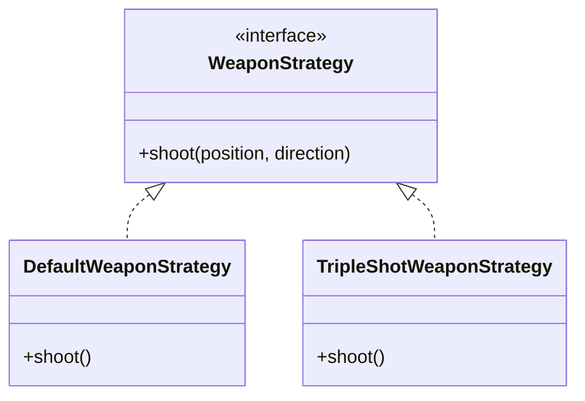

# 🎮 Neon Survivor - Enterprise Grade Survival Engine

Desenvolvido inteiramente no VS Code, este projeto representa uma implementação robusta e escalável de um motor de jogo 2D, utilizando práticas modernas de Engenharia de Software e a stack mais performática do ecossistema React.

## 🔭 Visão Geral

O **Neon Survivor** não é apenas um jogo; é uma demonstração técnica de um Game Loop determinístico desacoplado da camada de renderização. O coração do sistema é o `Survival Engine`, um motor físico leve capaz de gerenciar centenas de entidades simultâneas, detecção de colisão espacial e lógica de progressão (RPG), tudo rodando a 60 FPS estáveis.

A arquitetura foi desenhada para separar estritamente a **Lógica de Domínio (Core)** da **Camada de Apresentação (UI)**, garantindo manutenibilidade e testabilidade.

## 🛠️ Stack Técnica

A escolha tecnológica priorizou performance bruta e tipagem estrita:

- **Core**: TypeScript (Strict Mode) & HTML5 Canvas API (Renderização de baixo nível).
- **UI/HUD**: React 18+ (Gerenciamento de interfaces complexas).
- **Estilização**: Tailwind CSS (Design System atômico e responsivo).
- **Build Tool**: Vite (HMR instantâneo e build otimizado).
- **IDE**: VS Code (Com configurações avançadas de Linting e Debugging).

## 📐 Engenharia de Software e Design Patterns

### 1. Strategy Pattern (Sistema de Armas)
Para permitir uma jogabilidade dinâmica e extensível, o sistema de combate utiliza o **Strategy Pattern**. Isso permite que o comportamento de disparo do jogador seja trocado em tempo de execução sem alterar a classe `Player`.

- **Interface**: `WeaponStrategy` define o contrato `shoot()`.
- **Concreções**:
  - `DefaultWeaponStrategy`: Disparo linear simples.
  - `TripleShotWeaponStrategy`: Dispara 3 projéteis em arco (Shotgun style).
  - `OrbitalFireStrategy`: Cria um padrão de disparo em espiral ao redor do jogador.

Isso facilita a adição de novas armas (ex: Lasers, Mísseis) apenas criando novas classes que implementam a interface, respeitando o princípio **Open/Closed (OCP)** do SOLID.



### 2. State Machine (Fluxo de Jogo)
O gerenciamento dos estados do jogo (Menu, Jogando, Boss, Game Over) é controlado por uma **Máquina de Estados Finitos**.
- **Estados**: `start` -> `playing` -> `boss_fight` -> `gameover`.
- Transições claras e previsíveis evitam bugs de fluxo (ex: inimigos spawnando na tela de game over).

### 3. Object Pooling (Gerenciamento de Memória)
Em jogos de sobrevivência ("Bullet Heaven"), a criação e destruição de objetos (projéteis, partículas) é massiva.
- Implementamos um `ObjectPool` genérico que reutiliza instâncias inativas.
- Elimina a pressão sobre o Garbage Collector, prevenindo quedas de frame (lag spikes).

### 4. Física e Renderização
- **Spatial Hash Grid**: Otimização de colisão que divide o mundo em células. Em vez de verificar colisão de "todos contra todos" (O(n²)), verificamos apenas entidades na mesma célula (O(n)).
- **Game Loop Desacoplado**: A lógica física roda independente da taxa de quadros visual, garantindo consistência mesmo em monitores de 144hz ou computadores lentos.

## 🚀 Como Rodar

Este projeto foi otimizado para o VS Code. Siga os passos abaixo:

1. Instale as dependências:
   ```bash
   npm install
   ```

2. Execute o servidor de desenvolvimento:
   ```bash
   npm run dev
   ```

3. Acesse o jogo:
   O servidor iniciará automaticamente (geralmente em `http://localhost:5173`).

## 🔗 Links

- **GitHub Repository**: [Acesse o Código Fonte](https://github.com/FilipiWanderley/Bullet-Heaven)
- **Vercel Deployment**: [Jogue Agora](https://bullet-heaven-zeta.vercel.app/)

---
*Desenvolvido com paixão e rigor técnico por Filipi Moraes.*

<!-- v1.1 Update -->

## 🆕 Últimas Atualizações (v1.2 - Cyberpunk Overhaul)

Uma reformulação visual e de gameplay focada em "Game Juice" e estética Neon.

### 🌟 Efeitos Visuais e Feedback ("Juice")
- **Partículas Neon**: Explosões multicoloridas (Ciano, Magenta, Lima) com efeitos de cintilação (`Flicker`) e brilho variável.
- **Screen Shake & Glitch**: Sistema robusto de tremedeira de tela e distorção RGB (Aberração Cromática) para impactos críticos e Game Over.
- **Flash de Satisfação**: Efeito de flash branco aditivo ao coletar itens ou derrotar chefes, aumentando a recompensa sensorial.
- **Post-Processing**: Vignette dinâmica e sobreposições de cor para feedback de dano (Flash Vermelho).

## 📱 Atualizações Cross-Platform (v1.3 - Mobile & Responsividade)

Focada em garantir uma experiência consistente e fluida em qualquer dispositivo (Notebook, iPad, Mobile).

### 🕹️ Controles Adaptativos
- **Notebook/Desktop**: WASD para movimento, Mouse para mira, Teclas E (Escudo) e R (Elite).
- **Mobile/Tablet**:
  - **Joystick Virtual**: Movimentação suave com detecção de toque.
  - **Botões de Ação**: Botões dedicados para Escudo e Elite Rocket com feedback visual de recarga (cooldown).
  - **Toque para Atirar**: Mira e disparo intuitivos via toque na tela.

### 🛡️ Novas Mecânicas & Feedback
- **Escudo de Proteção (Tecla E / Ícone)**: Invulnerabilidade temporária com aura neon visual e indicador de cooldown.
- **Elite Rocket (Tecla R / Ícone)**: Transformação temporária que aumenta velocidade e poder de fogo.
- **Interface (HUD) Responsiva**: Elementos de UI reposicionados dinamicamente para garantir visibilidade e ergonomia em telas menores.

### ⚡ Otimização de Performance
- **Object Pooling Aprimorado**: Garantia de 60 FPS estáveis em dispositivos móveis.
- **Renderização Condicional**: Elementos de UI complexos simplificados ou ocultados em mobile para maximizar a área de jogo.

<!-- v1.3 Update -->

## ⚡ Atualização de Performance (v1.3 - Extreme Optimization)

Foco total em eliminar travamentos ("stutter") e garantir 60 FPS estáveis mesmo com milhares de entidades.

### 🧠 Otimizações de Memória e CPU
- **Spatial Hash Grid V2**: Refatoração completa do sistema de colisão.
  - Substituição de chaves `String` por `Bitwise Integers` (Zero alocação de strings por frame).
  - Reutilização agressiva de Arrays internos (Zero alocação de arrays por frame).
  - Resultado: Redução de ~90% na pressão do Garbage Collector (GC).
- **React Throttling**: O HUD agora atualiza a 6-10 FPS (desacoplado do render de 60 FPS do jogo), liberando a thread principal para a física e desenho do Canvas.

### 🎨 Otimizações de GPU
- **Additive Blending**: Substituição do custoso `ctx.shadowBlur` (CPU-bound) por `ctx.globalCompositeOperation = 'lighter'` (GPU-bound).
  - O efeito de brilho neon agora é "gratuito" para o processador, permitindo mais partículas sem queda de FPS.
- **Particle Budgeting**: Ajuste inteligente na taxa de emissão de partículas para manter o impacto visual com metade do custo computacional.

<!-- v1.4 Update -->

## 🚀 Novidades da v1.4 - Elite Mobility & Atmosphere

Uma atualização focada em imersão atmosférica e mobilidade extrema para o jogador.

### 🌌 Imersão Visual (Background System)
- **Hybrid Background System**: Sistema inteligente que carrega texturas de alta definição (Unsplash) para o fundo.
  - **Procedural Fallback**: Se a conexão falhar ou a imagem não carregar, o sistema muda automaticamente para renderização procedural de nebulosas, garantindo que o jogo nunca fique com fundo preto.
- **Parallax Scrolling**: Implementação de um fundo estelar com 3 camadas de profundidade que se movem em velocidades diferentes, criando uma sensação real de 3D.
- **Nebulosas Procedurais**: Nuvens de gás neon (Magenta, Ciano, Roxo) geradas dinamicamente.
- **Meteoros Dinâmicos**: Eventos aleatórios de meteoros cruzando o horizonte.

### 🏎️ Mobilidade e Habilidades
- **Elite Rocket Mode (SHIFT)**: Transformação temporária que triplica a velocidade (800px/s) e garante invulnerabilidade.
  - Efeitos visuais de "Warp Speed" (Linhas de velocidade e distorção de borda).
- **Escudo Cibernético (ESPAÇO)**: Habilidade defensiva que protege contra danos por 5 segundos.

### 🤖 Novos Desafios
- **Rocket Enemies**: Inimigos rápidos que perseguem o jogador (Homing Behavior) e explodem com ondas de choque ao morrer.
- **Feedback de Dano Aprimorado**: Screen Shake direcional e efeitos de flash vermelho aprimorados.
